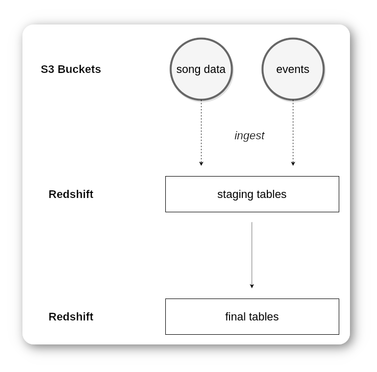

```
   _____                  __   _ ____     
  / ___/____  ____ ______/ /__(_) __/_  __
  \__ \/ __ \/ __ `/ ___/ //_/ / /_/ / / /
 ___/ / /_/ / /_/ / /  / ,< / / __/ /_/ /
/____/ .___/\__,_/_/  /_/|_/_/_/  \__, /  
    /_/                          /____/   
         a totally real startup company!

                                (c) 2020
```

## Intro

The purpose of our project is to ingest data from the given S3 buckets into our Redshift cluster.
During development we explored swifly the data stored in those buckets to help us design the appropriate schemas.

The project builds upon previous projects (especially the one in Postgresql), so we are already a bit familiar with
the data, and their interpretation. As a refresher, we are working with data related to songs (see Example 1) and song plays;
meaning logs (see Example 2) that contain user information and metadata alongside with information about tracks.

> Exampe 1 - Snippet from the songs database; in JSON format.

```json
{
   "num_songs":1,
   "artist_id":"ARD0S291187B9B7BF5",
   "artist_latitude":null,
   "artist_longitude":null,
   "artist_location":"Ohio",
   "artist_name":"Rated R",
   "song_id":"SOMJBYD12A6D4F8557",
   "title":"Keepin It Real (Skit)",
   "duration":114.78159,
   "year":0
}
```


> Example 2 - Snippet from the event log; in JSON format.

```json
{
   "artist":null,
   "auth":"Logged In",
   "firstName":"Walter",
   "gender":"M",
   "itemInSession":0,
   "lastName":"Frye",
   "length":null,
   "level":"free",
   "location":"San Francisco-Oakland-Hayward, CA",
   "method":"GET",
   "page":"Home",
   "registration":1540919166796.0,
   "sessionId":38,
   "song":null,
   "status":200,
   "ts":1541105830796,
   "userAgent":"\"Mozilla\/5.0 (Macintosh; Intel Mac OS X 10_9_4) AppleWebKit\/537.36 (KHTML, like Gecko) Chrome\/36.0.1985.143 Safari\/537.36\"",
   "userId":"39"
}
```

## Main Project

| Name             | Description                                                             |
|------------------|-------------------------------------------------------------------------|
| etl.py           | The main entrypoint of our application; staging & analytics             |
| create_tables.py | A script that drops and creates all the necessary tables in our cluster |
| sql_queries.py   | All backbone of our application; all the SQL queries are stored here!   |
| dwh.cfg          | Configuration settings for our data warehouse setup in AWS              |

First, make sure you have all the required packages. You may install them with:

```bash

pip install -r requirements.txt

```

Regarding, our main project; it is recommended to execute the following scripts in order:

1. ```python create_tables.py```
2. ```python etl.py```

## Overview of data warehousing



## Fact Tables

> **songplays** - records in event data associated with song plays i.e. records with page NextSong

| Column name | Type                   | Extra            |
|-------------|------------------------|------------------|
| songplay_id | INTEGER IDENTITY(0, 1) | NOT NULL SORTKEY |
| start_time  | TIMESTAMP              | NOT NULL         |
| user_id     | INTEGER                | NOT NULL DISTKEY |
| level       | VARCHAR(5)             | NOT NULL         |
| song_id     | VARCHAR(18)            | NOT NULL         |
| artist_id   | VARCHAR(256)           | NOT NULL         |
| session_id  | VARCHAR(500)           | NOT NULL         |
| location    | VARCHAR(100)           | NULL             |
| user_agent  | VARCHAR(256)           | NULL             |

## Dimension Tables

> **users** - users in the app

| Column name | Type         | Extra            |
|-------------|--------------|------------------|
| user_id     | INTEGER      | NOT NULL SORTKEY |
| first_name  | VARCHAR(256) | NULL             |
| last_name   | VARCHAR(256) | NULL             |
| gender      | VARCHAR(1)   | NULL             |
| level       | VARCHAR(5)   | NULL             |

with `DISTSTYLE ALL`

> **songs** - songs in music database

| Column name | Type         | Extra               |
|-------------|--------------|---------------------|
| song_id     | VARCHAR(18)  | NOT NULL SORTKEY    |
| title       | TEXT         | NOT NULL            |
| artist_id   | VARCHAR(256) | NOT NULL            |
| year        | INTEGER      | NOT NULL DEFAULT(0) |
| duration    | DECIMAL(10)  | NOT NULL            |

> **artists** - artists in music database

| Column name | Type         | Extra            |
|-------------|--------------|------------------|
| artist_id   | VARCHAR(256) | NOT NULL SORTKEY |
| name        | VARCHAR(256) | NULL             |
| location    | VARCHAR(256) | NULL             |
| lattitude   | DECIMAL      | NULLL            |
| longitude   | DECIMAL      | NULL             |

with `DISTSTYLE ALL`

> **time** - timestamps of records in songplays broken down into specific units

| Column name | Type      | Extra            |
|-------------|-----------|------------------|
| start_time  | TIMESTAMP | NOT NULL SORTKEY |
| hour        | SMALLINT  | NULL             |
| day         | SMALLINT  | NULL             |
| week        | SMALLINT  | NULL             |
| month       | SMALLINT  | NULL             |
| year        | SMALLINT  | NULL             |
| weekday     | SMALLINT  | NULL             |

with `DISTSTYLE ALL`


## Staging tables

> stagingevents 

| Column name      | Type      | Extra                    |
|---------------|--------------|--------------------------|
| event_id      | BIGINT       | IDENTITY(0,1)  NOT NULL  |
| artist        | VARCHAR      | NULL                     |
| auth          | VARCHAR(100) | NULL                     |
| firstName     | VARCHAR      | NULL                     |
| gender        | VARCHAR(2)   | NULL                     |
| itemInSession | VARCHAR      | NULL                     |
| lastName      | VARCHAR      | NULL                     |
| length        | VARCHAR      | NULL                     |
| level         | VARCHAR(5)   | NULL                     |
| location      | VARCHAR(256) | NULL                     |
| method        | VARCHAR(10)  | NULL                     |
| page          | VARCHAR(100) | NULL                     |
| registration  | VARCHAR      | NULL                     |
| sessionId     | INTEGER      | NOT NULL SORTKEY DISTKEY |
| song          | VARCHAR      | NULL                     |
| status        | INTEGER      | NULL                     |
| ts            | BIGINT       | NOT NULL                 |
| userAgent     | VARCHAR      | NULL                     |
| userId        | INTEGER      | NULL                     |

> stagingsongs

| Column name      | Type         | Extra                    |
|------------------|--------------|--------------------------|
| num_songs        | INTEGER      | NULL                     |
| artist_id        | VARCHAR(256) | NOT NULL SORTKEY DISTKEY |
| artist_latitude  | DECIMAL      | NULL                     |
| artist_longitude | DECIMAL      | NULL                     |
| artist_location  | VARCHAR(256) | NULL                     |
| artist_name      | VARCHAR(256) | NULL                     |
| song_id          | VARCHAR(18)  | NOT NULL                 |
| title            | TEXT         | NULL                     |
| duration         | DECIMAL(10)  | NULL                     |
| year             | INTEGER      | NULL DEFAULT(0)          |


## Staging queries

Below is an example of the staging queries we used to ingest data from the given S3 Buckets
into our database.

```sql
COPY stagingsongs FROM s3://udacity-dend/song_data
    CREDENTIALS 'aws_iam_role={ARN}' FORMAT AS JSON 'auto'
STATUPDATE ON REGION 'us-west-2';
```


## Example queries and results

### Query `artists`

```sql
SELECT COUNT(*) FROM artists
```

| count |
|-------|
| 10025 |

- - -

```sql
SELECT * FROM artists LIMIT(10)
```

| artist_id          | name               | location              | latitude | longitude |
|--------------------|--------------------|-----------------------|----------|-----------|
| AR00B1I1187FB433EB | Eagle-Eye Cherry   | Stockholm, Sweden     |          |           |
| AR00DG71187B9B7FCB | Basslovers United  |                       |          |           |
| AR00FVC1187FB5BE3E | Panda              | Monterrey, NL, México | 25       | -100      |
| AR00JIO1187B9A5A15 | Saigon             | Brooklyn              | 40       | -73       |
| AR00LNI1187FB444A5 | Bruce BecVar       |                       |          |           |
| AR00MQ31187B9ACD8F | Chris Carrier      |                       |          |           |
| AR00TGQ1187B994F29 | Paula Toller       |                       |          |           |
| AR00Y9I1187B999412 | Akercocke          |                       |          |           |
| AR00YYQ1187FB504DC | God Is My Co-Pilot | New York, NY          | 40       | -74       |
| AR016P51187B98E398 | Indian Ropeman     |                       |          |           |

- - -

```sql

SELECT COUNT(*) FROM users

```

| count |
|-------|
| 104   |

```sql

WITH total AS (
  SELECT COUNT(*) AS total FROM users
)
SELECT users.gender, COUNT(*) / CAST(total.total AS FLOAT) AS percentage
FROM
    users, total
GROUP BY users.gender, total
ORDER BY users.gender

```

| gender | percentage         |
|--------|--------------------|
| F      | 0.5769230769230769 |
| M	     | 0.4230769230769231 |

## Dev Resources

In the directory `dev` one can find a small collection of scripts that were used while developing the application.

| Name                      | Description                                                                                             |
|---------------------------|---------------------------------------------------------------------------------------------------------|
| IaC_up.ipynb              | brings up the AWS infrastructure                                                                        |
| IaC_down.ipynb            | releases all the resources from AWS                                                                     |
| explore_bucket_data.ipynb | fetch some random files from the S3 Bucket (in `bucket_data/`); helps us design the schema a bit better |
| dwh.cfg                   | Configuration settings for our data warehouse setup in AWS                                              |

Notes:
> During development the `eu-central-1` region was selected, but the given S3 Bucket reside in `us-west-2`.
> So, in the final release of the project we also switched to `us-west-2`.
