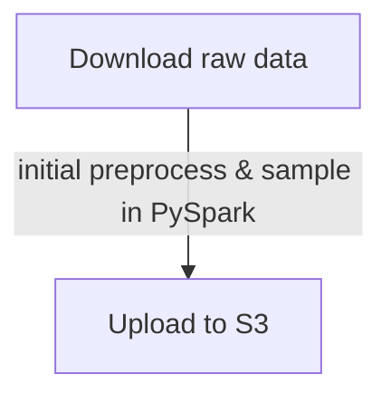
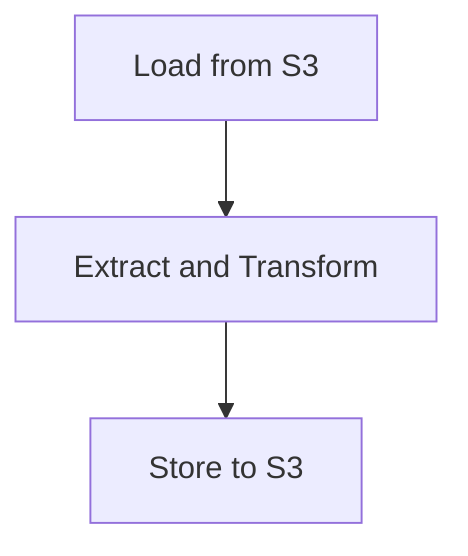
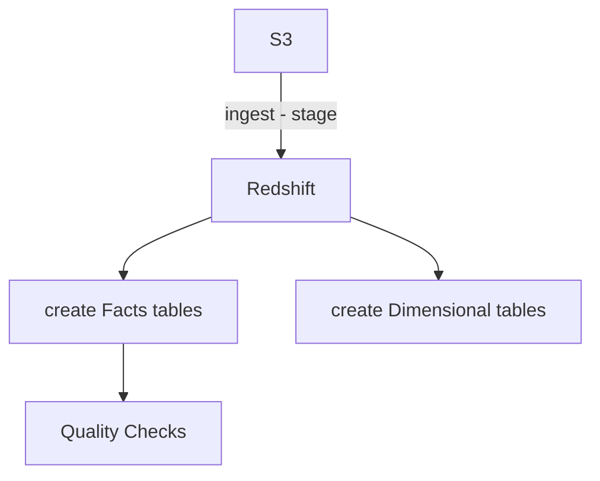
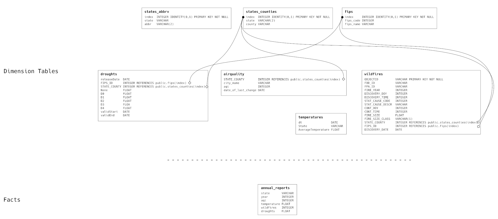

## Write up
> Avraam Marimpis <avraam.marimpis@gmail.com> <br/>
> October 2020, available on [GitHub](https://github.com/makism/udacity-dataengineer-nanodegree/edit/master/5%20-%20Capstone)

> to properly view the graphs you may need to installl mermaid https://github.com/mermaid-js/mermaid

### 1. Intro

Our project follows a semi-realistic scenario in which, we gather, process and publish enviromental information for the US states.
The datasets we are using are drawn from US Environmental Protection Agency (EPA) and published on Kaggle.

* [Historical Air Quality](https://www.kaggle.com/epa/epa-historical-air-quality)
> It contains more than 8 million observations related to air quality, across the US states from multiple monitors. The data are stored in Google's BigQuery; we have added instructions how to fetch them.

* [US Wildfires](https://www.kaggle.com/rtatman/188-million-us-wildfires)
> A big dataset with 1.88 million wildfires recorded in the US. It contains important geographical information (GIS). The dataset is in an SQLite3.

* [Climate Change: Earth Surface Temperature Data](https://www.kaggle.com/berkeleyearth/climate-change-earth-surface-temperature-data/)
> A historical dataset with land temperatures going back around 1750-1850, from the capitals of the world, and each US state. Stored as a standard CSV.

* [United States Droughts by County](https://www.kaggle.com/us-drought-monitor/united-states-droughts-by-county)
> Weekly collected data on drought conditions around the U.S. Stored in a standard CSV.

### 2. Project

#### TLDR;

A quick summary of the pipeline and some notes.

| # | Summary                     | Where                            | Notes |
|---|-----------------------------|----------------------------------|-------|
| 1 | Setup your AWS credentials. | IaC/dwh.json                     |       |
| 2 | Allocate resources.         | IaC/aws_create_cluster.py        | can be skipped if you want to run local |
| 3 | Fetch datasets              | raw_data/README.md               | |
| 4 | Fetch precomputed artifacts | 0 - Fetch Raw Data and Artifacts | fetch the samples and artifacts we used |
| 5 | Load and sample datasest    | 1 - Load and Sample.ipynb        | consult `config/data.py` for more settings |
| 6 | ETL                         | 2 - ETL.ipynb                    | |
| 7 | Model                       | 3 - Model.ipynb                  | |
| 8 | Quality Checks              | 4 - QC.ipynb                     | |
| 9 | Analytics                   | 5 - Analytics.ipynb              | @TODO |

#### Infrastructure

Our project is developed is such way, that can run both locally, but also in an Amazon EMR cluster.
Also, there are special configuration settings (found in the directory `config/`), that manage other aspects of our project. For example, in `config/data.py` there are numerous settings and options related to the location storage of the artifacts, sampling options and imputation.

One can manage easily most aspects of the cloud infrastructure through the helper programs we developed, and ship in the directory `IaC/`. It is imperative you provide your AWS credentials and setup the settings in `dev/dwh.json`. Please check the extra documentation in `IaC/README.md`.

Regarding Apache Spark, the following considerations must be made. First and foremost, we must add the relevant AWS SDK libraries (JARs), so as we can access Amazon S3 buckets:


You may fetch them from the Maven repository.

| Library                | Maven Repository                                                              |
|------------------------|-------------------------------------------------------------------------------|
| aws-java-sdk-1.7.4.jar | [link](https://mvnrepository.com/artifact/com.amazonaws/aws-java-sdk/1.7.4)   |
| hadoop-aws-2.7.2.jar   | [link](https://mvnrepository.com/artifact/org.apache.hadoop/hadoop-aws/2.7.2) |


Other useful resources on configuring Apache Spark include:
* [S3 Endpoints](https://docs.aws.amazon.com/general/latest/gr/s3.html)
* [S3 settings](https://hadoop.apache.org/docs/stable/hadoop-aws/tools/hadoop-aws/index.html#Other_S3_Connectors)

Our sample setup looks like the following

```python
spark.stop()

spark = SparkSession.builder \
            .appName("my_app") \
            .config('spark.sql.codegen.wholeStage', False) \
            .config("spark.driver.extraClassPath", "/home/vagrant/opt/libs/aws-java-sdk-1.7.4.jar") \
            .config("spark.jars", "/home/vagrant/opt/libs/hadoop-aws-2.7.2.jar") \
            .getOrCreate()

spark._jsc.hadoopConfiguration().set("fs.s3a.access.key", dwh['aws']['access_key_id'])
spark._jsc.hadoopConfiguration().set("fs.s3a.secret.key", dwh['aws']['secret_access_key'])

spark._jsc.hadoopConfiguration().set("fs.s3a.impl","org.apache.hadoop.fs.s3a.S3AFileSystem")
spark._jsc.hadoopConfiguration().set("com.amazonaws.services.s3.enableV4", "true")
spark._jsc.hadoopConfiguration().set("fs.s3a.aws.credentials.provider","org.apache.hadoop.fs.s3a.BasicAWSCredentialsProvider")
spark._jsc.hadoopConfiguration().set("fs.s3a.endpoint", f"s3.{dwh['aws']['region']}.amazonaws.com")

sc = spark.sparkContext
sc.setSystemProperty("com.amazonaws.services.s3.enableV4", "true")

```


#### Project structure

| Resource         | Description |
|------------------|-------------|
| artifacts/       | all the generated files will be stored here; i.e. json, csv, etc. |
| common/          | commonly used and shared functions are defined here, such as the `logger`. |
| common/redshift/ | Redshift's SQL-related queries are defined here and separted in classes for organizational purposes. |
| config/          | settings and options for our project, i.e. target of storing/reading the artifacts (local or S3). |
| dev/             | Jupyter notebooks during development cycle. |
| IaC/             | Infrastructure as code. |
| json_paths/      | The json_paths for each JSON file we stage from S3 to Redshift. |
| logs/            | log files are written here. |
| raw_data/        | well, the raw data. |
| .                | the root directory contains all the pipelines in Jupyter Notebook format. |

#### Pipelines

In this paragraph, we will describe shortly each step in our proposed pipeline.

##### 0 - Fetch Raw Data and Artifacts.ipynb

We have provided a simple script to fetch the required raw data, and artifacts. This way, one can be able to replicate our work.

##### 1 - Load and Sample.ipynb



###### Fetching the data
The datasets we are using are publicly available. A set of instructions is provided how to fetch them in `raw_data/`.

###### Data description
Due to the reason that we will using four big datasets, we provide the descriptions (and their fields/columns) in the directory `dev/`.
During the initial preprocessing, we will drop a large number of the columns, so in the subsequent paragraph `Model`, we will discuss their subsets and relations during staging and after.

###### Initial preprocessing

The focus of this step (`1 - Load and Sample.ipynb`) is to perform an initial preprocessing, sampling and storing the original datasets.

As soon as you have the data downloaded, and named properly, the next step is to start the processing pipeline. First, we will parse the data (with the defined schemas) using Apache Spark and save them into JSON or CSV files. Then, we will push the files to an S3 bucket (or store them locally when development).

One can either use the complete big datasets (literally millions of records) or use smaller samples. This option is controlled by the variable `DATASET_SAMPLE` in file `config/data.py`; and by default we set the sampling `fraction=0.05`.

For your convenience we have provided the smaller samples we have used in `raw_data/`.

During this first, we load each dataset in Apache Spark and define a very basic Schema; with the exception of the dataset "Wildfires", which is in an SQLite3 format. Below we'll highlight the transformations of the different columns per dataset.

> Wildfires 

| Column         | Transformation |
|----------------|----------------|
| DISCOVERY_DATE | conversion from Julian to Gregorian dates though Pandas |
| CONT_DATE      | conversion from Julian to Gregorian dates though Pandas |

> Air Quality 

No transformations...

> Droughts

| Column         | Transformation |
|----------------|----------------|
| county         | remove the string " County " from all the strings |

> Global Temperatures

In this dataset, we filter only the relevant records with:

```sql
"Country" == "United States"
```

afterwards, we drop the column "Country".

##### 2 - ETL.ipynb

The purpose of this step is to load the JSON and CSV files generated from the previous step. We process each dataset in Apache Spark and define a strict Schema.

We check the standard statistics for each dataset, using the internal `describe().toPandas().transpose()` methods; and try to identify possible issues.

Furthermore, we have developed two helper functions called `preprocess_fn.missing_fields_perc()` and `preprocess_fn.count_duplicates()`. The first one, check the columns of numeric type (IntegerType, DoubleType, FloatType) for missing values (`NaN`s and `Null`s), and reports back the percentage across all the records. The other function, just reports the number of duplicate rows.

Also, for all datasets, we have to do `na.fill("")` in case of fields of StringType; otherwise, Apache Spark, drops these fields when saving to JSON format.



> Wildfires

We just drop the following unecessary fields: `FIRE_CODE`, `FIRE_NAME`, `ICS_209_INCIDENT_NUMBER`, `ICS_209_NAME`, `MTBS_ID`, `MTBS_FIRE_NAME`, `COMPLEX_NAME`, `DISCOVERY_DATE`, `CONT_DATE`.

Finally, we add two partition fields, `part_year` and `part_month`, as extracted from the field `DISCOVERY_DATE_converted`.

> Air Quality

The most important transformations are:

1. Fill in the missing values for the column `method_code` with an extreme value, i.e. -1, and,
2. Fill in the missing values for columns of StringType with "".

> Droughts

Since the column `domStatisticFormatID` is equal to `1` across all records, we can safely drop it.
As, we did we the previous datasets, we will create the partition fields, `part_year` and `part_month`. Furthermore, for the field `NONE`, we will fill in the missing values with -1 and the rest of the StringType columns with "".

> Temperatures

A quick exploratory analysis unveils a huge amount of `NaN`s. After some exploration, we can come into the conclusion that the `NaN`s, actually represent missing rows for the specific years. So, we will have to insert dummy records, filled with zeros for the states that do not have these records.

We notice lots of missing values; so we can try impute them using the average temperature per state. We could also take the average temperature for each state per month across all the yearly recordings. More sofisticated strategies include, building a linear regression model (although this depends whether or not the colinearity of the variables); and more data sources and observations. 

The snippet for imputing values is as simple as:

```python
...

from pyspark.ml.feature import Imputer

all_states = df.select("State").distinct().collect()

new_dfs = []
for state in all_states:
    imputer = Imputer(strategy="mean", inputCols=["AverageTemperature"], outputCols=["AverageTemperature_imputed"])
    df_state = df.filter(fn.col("State") == state[0])
    imputed_state = imputer.fit(df_state).transform(df_state)

    new_dfs.append(imputed_state)

...
   
```

Finally, we will fill in the missing values of the columns `AverageTemperatureUncertainty` and `AverageTemperature` with extreme values (`-10000.0`) so when we dump the JSON, Apache Spark will not exclude them.

> Upload to S3

The final step is to upload the generated files to the given S3 bucket.

##### 3 - Model.ipynb



> User Defined Functions (UDFs)

For our convenience, we declared the following UDF which we reused multiple times:

```
-- Cast, if able the given column to integer.
CREATE OR REPLACE FUNCTION f_my_cast (VARCHAR)
    RETURNS INTEGER
VOLATILE
AS $$
    SELECT
        CASE  
            WHEN $1 = '' THEN -1 
            ELSE CAST(CAST($1 AS FLOAT) AS INTEGER)
END $$ LANGUAGE sql;
```

It simply tries to convert a column of type VARCHAR that stores an INTEGER.


> Staging Tables

First and foremost, we declared the staging tables, as depicted in the following image. The types are very loose and there are no relation defined.


It is important to mention here, that when we ingest from an S3 bucket into the stagle table, we also specify our previously define JSON PATH. Otherwise, some columns are left empty.

> Model

1. Dimension Tables

After, we ingested all the data into our staging tables, the modeling begins. There are four obvious tables

* Wildfires
* Air Quality
* Droughts
* Temperatures

However, due to repetitive values, we can create the following extra tables

* FIPS
* States and Counties

and a helper table

* States Abbreviations.

2. Facts Tables.

Our fact table is called `annual_report` and summarises per state, per year the average air quality, temperature, number of wildfires, and an index of droughts. Of course because there are many missing timeseries, only a handful will be returned.

To fillin this table we following query that combines all the seven tables into one:

```sql
            INSERT INTO public.annual_reports (state, year, aqi, temperature, wildfires, droughts)
            WITH states_counties_index AS 
            (
                SELECT
                    * 
                FROM
                    states_counties 
            )
            ,
            states_abbrv AS 
            (
                SELECT
                    * 
                FROM
                    states_abbrv 
            )
            ,
            yearly_aqi AS
            (
                SELECT
                    SC_IDX.state,
                    DATE_PART_YEAR(AQI.date_of_last_change) AS year,
                    AVG(AQI.aqi) AS AVG_AQ 
                FROM
                    airquality AS AQI,
                    states_counties_index AS SC_IDX 
                WHERE
                    SC_IDX.index = AQI.STATE_COUNTY 
                GROUP BY
                    SC_IDX.state,
                    year 
            )
            ,
            yearly_temperatures AS 
            (
                SELECT
                    states_abbrv.abbr AS state_abbreviated,
                    DATE_PART_YEAR(dt) AS year,
                    AVG(averagetemperature) AS avg_temp 
                FROM
                    temperatures,
                    states_abbrv 
                WHERE
                    states_abbrv.state = temperatures.state 
                GROUP BY
                    state_abbreviated,
                    year 
                ORDER BY
                    state_abbreviated,
                    year 
            )
            ,
            yearly_wildfires AS 
            (
                SELECT
                    SC_IDX.state AS state,
                    FIRE_YEAR,
                    COUNT(*) AS total 
                FROM
                    wildfires AS WF,
                    states_counties_index AS SC_IDX 
                WHERE
                    SC_IDX.index = WF.STATE_COUNTY 
                GROUP BY
                    SC_IDX.state,
                    FIRE_YEAR 
                ORDER BY
                    SC_IDX.state ASC,
                    FIRE_YEAR ASC 
            )
            ,
            yearly_droughts AS 
            (
                SELECT
                    SC_IDX.state,
                    DATE_PART_YEAR(releasedate) AS year,
                    AVG(GREATEST(NONE, D0, D1, D2, D3, D4)) AS avg_drought_coeff 
                FROM
                    droughts,
                    states_counties_index AS SC_IDX 
                WHERE
                    SC_IDX.index = droughts.STATE_COUNTY 
                GROUP BY
                    SC_IDX.state,
                    year 
                ORDER BY
                    SC_IDX.state ASC,
                    year ASC 
            )
            SELECT
                yearly_aqi.state,
                yearly_aqi.year,
                yearly_aqi.avg_aq,
                yearly_temperatures.avg_temp,
                yearly_wildfires.total,
                yearly_droughts.avg_drought_coeff 
            FROM
                yearly_aqi 
                JOIN
                    yearly_temperatures 
                    ON yearly_aqi.state = yearly_temperatures.state_abbreviated 
                    AND yearly_aqi.year = yearly_temperatures.year 
                JOIN
                    yearly_wildfires 
                    ON yearly_aqi.state = yearly_wildfires.state 
                    AND yearly_aqi.year = yearly_wildfires.FIRE_YEAR 
                JOIN
                    yearly_droughts 
                    ON yearly_aqi.state = yearly_droughts.state 
                    AND yearly_aqi.year = yearly_droughts.year 
            ORDER BY
                yearly_aqi.state ASC,
                yearly_aqi.year ASC
```



##### 4 - QC.ipynb

This notebook run iteratively a few qualit checks across all the defined tables. These checks have been also used during the development process.

These checks actually are inspired from unit testing; a simple test may look like the following:

```python
"query": """
    SELECT COUNT(*) FROM stage_wildfires;
""",
"not_expected": 0
```

So, we know the sql query to execute, and the condition by which we will decide whether or not the test has passed. In this example, the condition is `"not_expected": 0`, which means that, the test will pass as long as there are some rows in the table.

##### 5 - Analytics.ipynb

@TODO


### 3. Scenarios


1. The data was increased by 100x

Since we deploy our project on an AWS EMR cluster and Redshift, we can easily just add more nodes. We can further optimize the tables by setting SORT and DISTKEYs based on performance.

2. The data populates a dashboard that must be updated on a daily basis by 7am every day

We can easily run our whole project using Apache Airflow. Airflow, provide an operator called "papermill" that executes Jupyter Notebooks (just like in our case). So, we could schedule them in Airflow at a time frame when there's little to no traffic.

3. The database needed to be accessed by 100+ people

We could maintain a smaller Redshift cluster that is related to the pipeline, and push the facts tables to a separate highly available Redshift cluster.
